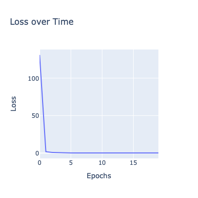
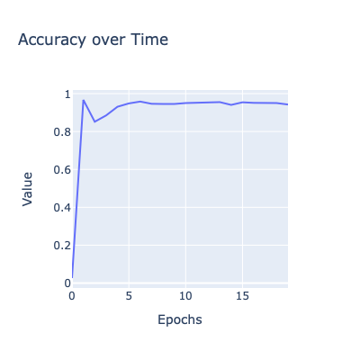

# Graph Convolutional Network (GCN) for Fraudulent User Detection

In this project, I aim to detect fraudulent users on the Amazon e-commerce platform using a Graph Convolutional Network (GCN). The dataset is an open source fraud detection dataset created by Amazon, specifically in the Musical Instruments category. The dataset consists of user information and handcrafted features, as well as connections between users based on textual similarities in their reviews.

## Dataset Description

The dataset comprises two main files:

1. **node_information.csv:** This file contains the node information, where each node represents a user on the Amazon e-commerce platform. The file includes a node_id as the first column, followed by 25 features representing statistical properties of the user's behaviors. The last column indicates the label of the user, with a value of 0 denoting a benign user and 1 denoting a fraudulent user.

2. **edge_data.csv:** This file contains the connections between users. Each row represents an edge between a source and destination node, indicating a connection between the two users.

## Graph Convolutional Network (GCN)

To construct the graph, we consider users who exhibit the top 5% mutual review text similarities. This similarity is calculated using TF-IDF (Term Frequency-Inverse Document Frequency) to capture textual resemblances among users. By connecting users with high textual similarities, we aim to capture communication patterns that may provide insights into fraudulent user behavior.

GCN is a type of neural network architecture specifically designed for graph-structured data. It leverages the connections and relationships between nodes in a graph to learn representations and make predictions. GCN offers several benefits for fraud detection in this context:

1. **Capturing Local and Global Information:** GCN aggregates information from a node's immediate neighborhood, allowing it to capture local patterns. Additionally, it also considers information from the broader graph structure, enabling the incorporation of global patterns and dependencies.

2. **Handling Graph-Structured Data:** GCN operates directly on graph-structured data, preserving the inherent relational information. Ex: In Social Network graph, each node would be considered user and the edge would be considered as friend relationship. By taking into account both the node features and the connectivity patterns, GCN can effectively model complex relationships among users.

The GCN model takes advantage of the graph structure and its ability to capture local and global patterns, making it a powerful tool for fraud detection tasks.

<!-- 
 -->

    
    

For further details and a deeper understanding of the features and the overall methodology, refer to the original paper ["Graph Convolutional Networks for Fraud Detection on Amazon"](https://arxiv.org/pdf/2005.10150.pdf).

Happy exploring and detecting fraudulent users using GCN!
